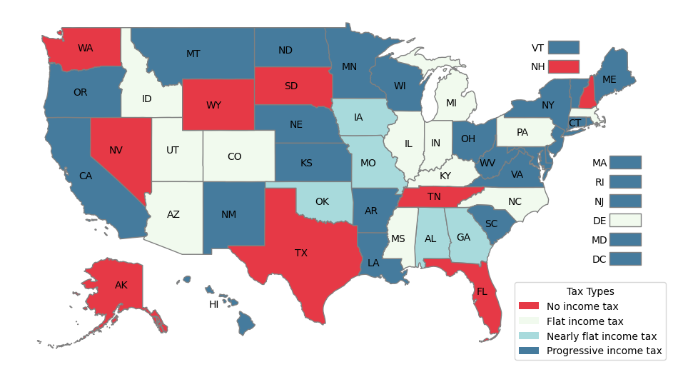
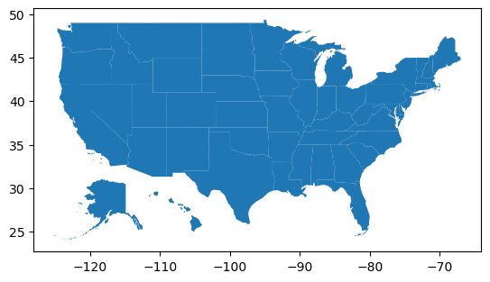
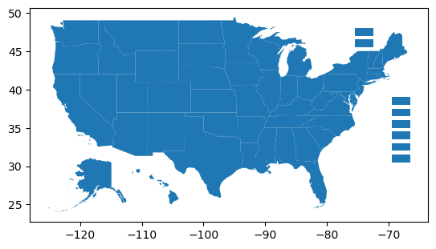

# GeoTax

Reusable US state-map templates (GeoJSON) and tax-system choropleths for tax research.




*Every state colored by the kind of income tax it runs, with Alaska and Hawaii pulled into the usual inset positions and the small eastern states given labeled boxes.*

## What it does

GeoTax builds clean, reusable map templates so I don't rebuild a US map from scratch every time a tax question needs a picture. There are two parts: the templates, and a demo that uses them.

**The templates.** Two builder scripts download the Census Bureau's `cb_2018_us_state_20m` state boundaries, drop Puerto Rico, and write out reusable GeoJSON files you can color however you like:

- `state_map.json` — state shapes, no labels.
- `state_map_w_abb.json` — state shapes plus longitude/latitude points for placing each state's two-letter abbreviation, with small boxes added to the right edge so crowded states in the Northeast (DE, DC, MD, MA, NJ, RI, VT, NH) get a readable label off to the side.

**The Alaska and Hawaii repositioning.** This is the part that took real work. Census state boundaries put Alaska and Hawaii where they actually are, which makes a normal US map mostly empty ocean. The builder scripts walk the raw coordinate arrays and do the math by hand: Alaska's positive longitudes (the Aleutians cross the antimeridian) get unwrapped to negative values, then the whole state is shrunk, slid east and north toward the lower 48, and stretched vertically to look right at the smaller scale. Hawaii gets scaled up, then moved into the standard inset slot below the mainland. The result is the familiar "inset" US layout, baked into the GeoJSON so you never have to redo it.

**The tax-type choropleth demo.** `State_tax_type.csv` tags every state with an income-tax category, and the notebook joins that onto the template and colors the map:

| Code | Category | Meaning |
|------|----------|---------|
| 0 | No income tax | State levies no individual income tax |
| 1 | Flat income tax | Single rate across all income |
| 2 | Nearly flat income tax | A small number of close rates |
| 3 | Progressive income tax | Rates rise with income |

(Categories reflect state systems as of early 2023.)

## Maps

**State tax-system choropleth** — the payoff map. States shaded by tax category, AK/HI repositioned, small eastern states labeled with boxes.


**Plain state template** (`state_map.json`) — the base layer, ready to color from any dataset.



**Abbreviation template** (`state_map_w_abb.json`) — same shapes, with the inset boxes on the right edge that hold labels for the small Northeast states.



## What's in here

| File | What it is |
|------|------------|
| `create_state_map_json.py` | Builds `state_map.json`: downloads boundaries, repositions AK/HI, writes the plain template. |
| `create_state_map_json_w_abb.py` | Builds `state_map_w_abb.json`: same, plus abbreviation points and the Northeast label boxes. |
| `state_map.json` | Generated plain state template (GeoJSON). |
| `state_map_w_abb.json` | Generated template with abbreviation data (GeoJSON). |
| `first_map.ipynb` | Working notebook: builds the map and renders the tax-type choropleth shown above. |
| `map_demos.ipynb` | Short demo: loads each template and plots it. |
| `State_tax_type.csv` | State, abbreviation, and tax-type code (0-3). |
| `state_abbr.csv` | Abbreviation label coordinates (`Abbrev`, `ab_lon`, `ab_lat`). |
| `data/cb_2018_us_state_20m/` | Local copy of the Census shapefile the builders read. |

## How to use it

Load a template, attach your own data, color the states.

```python
import json
import geopandas as gpd
import pandas as pd
import matplotlib.pyplot as plt

# Load the prebuilt template (AK/HI already repositioned)
with open("state_map.json") as f:
    gjson = json.load(f)

# Join your data on the two-letter state code (STUSPS)
tax = pd.read_csv("State_tax_type.csv")
for feature in gjson["features"]:
    code = feature["properties"]["STUSPS"]
    feature["properties"]["TaxType"] = int(
        tax.loc[tax["Abbrev"] == code, "TaxType"].values[0]
    )

# Build a GeoDataFrame and plot
gdf = gpd.GeoDataFrame.from_features(gjson, crs="EPSG:4326")
gdf.plot(column="TaxType", cmap="viridis", edgecolor="gray")
plt.show()
```

To rebuild the GeoJSON templates from the source shapefile, run the builder scripts:

```bash
python create_state_map_json.py        # writes state_map.json
python create_state_map_json_w_abb.py  # writes state_map_w_abb.json
```

The scripts as written pull the shapefile from a GitHub URL; a local copy also lives in `data/cb_2018_us_state_20m/` if you'd rather point them there.

### Dependencies

There's no requirements file yet. The code imports:

- `geopandas` (reads the shapefile, builds the GeoDataFrame)
- `pandas`
- `numpy`
- `matplotlib`

The notebooks also touch `plotly` and `bokeh` in a couple of exploratory cells, but the core template-building and the tax-type choropleth need only the four above.

```bash
pip install geopandas pandas numpy matplotlib
```

## Why I built it

I do tax research on a financial-economics and accounting background, and a lot of that work ends in a map: which states tax income, how, and how the picture shifts when a rule changes. Rebuilding the AK/HI inset every time was the annoying part, so I solved it once and made the templates reusable. This is a small piece of how I work now as the AI-and-accounting person: take a repetitive analytical chore, write the code once, and keep the output clean enough to drop straight into research.

## Author

Patrick Neyland — [Neyland Solutions](https://neylandsolutions.com)
